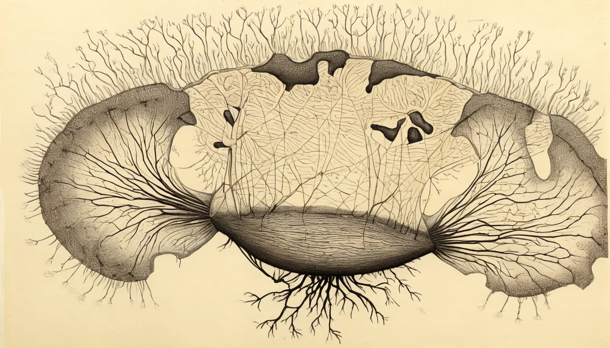
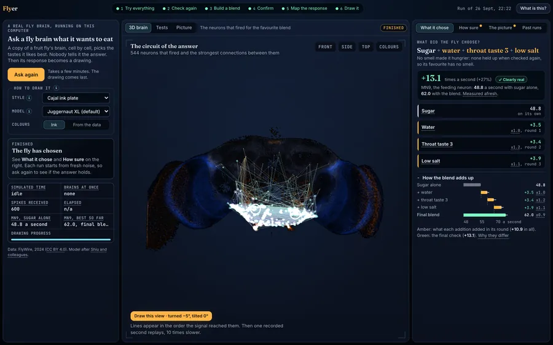

# Flyer

**We asked a fruit-fly brain what it wants to eat, then drew what its brain did.**

Flyer runs a whole fruit-fly brain (138,639 neurons, wired from the real connectome) as a simulation on your own
computer. Sugar is always on, and the brain decides what else it likes out of 63 tastes and smells. Then its response
is drawn as an old-fashioned ink plate.

<p align="center"></p>

**[Story and results](https://flyer.pixelabs.net)** · **[Run it](#run)** · **[Credits](#credits-and-licence)**

> **The brain isn't ours.** The wiring map is the [FlyWire](https://flywire.ai/) connectome, built by the FlyWire
> Consortium (Princeton University, Janelia Research Campus and the MRC Laboratory of Molecular Biology) and shared
> under CC BY 4.0. The simulation model is from [Shiu et al.](https://github.com/philshiu/Drosophila_brain_model)
> (*Nature*, 2024). Flyer adds the experiment that asks the brain what it likes, and the drawings. Full credits and
> citations are [below](#credits-and-licence).

## What you get

- **A choice made by the wiring.** There is no menu and no recipe. With sugar as a fixed baseline, every other taste
  and smell is added one at a time and the feeding readout is measured (MN9, the proboscis motor neuron). Promising
  channels are re-tested, combined and confirmed with fresh random noise.
- **A portrait drawn from data.** The neurons that fired, at their real 3D positions, and the synapses between them
  become a data portrait and a line map. An SDXL image model draws over them in a style you pick (Cajal ink plate,
  etching, sumi-e, cyanotype). The prompt names a style, never food.
- **Honest drawings.** A fidelity score says how much of a drawing sits on real data, and a *strict* version keeps only
  ink near real data lines. Any saved run can be redrawn from any angle, with any qualified model, without re-running
  the simulation.
- **Everything local.** It runs on your GPU, draws through your own ComfyUI, and uploads nothing.

<p align="center"></p>

## Result

**The brain picked water, a little salt and one taste from the throat. It never picked a smell.**

Sugar was always on. On top of it, the brain added water, low salt and a pharyngeal (throat) taste, and with that
blend its feeding neuron (MN9) fired about 12 to 16 spikes per second more than with sugar alone. We ran the whole
search six times from fresh random noise and got the same answer every time. The only thing that changed was which
throat channel came along (group 2 in four runs, group 3 in two).

What each channel did to feeding when it was added to sugar on its own (run 3, change in MN9 spikes per second):

| Channel | Change | |
|---|---|---|
| Water | **+7.0** | feeding goes up |
| Low salt | **+4.9** | feeding goes up |
| Throat taste (group 2) | **+4.2** | feeding goes up |
| Green-leaf smell | +0.1 | nothing |
| Citrus smell | −7.4 | feeding goes down |
| Vinegar smell | −9.5 | feeding goes down |
| Bitter | −26.7 | feeding goes down hard |

Of the 53 smells, 18 pushed feeding down and the other 35 did nothing, so no smell was picked. That says which inputs
make this brain *eat*, not which ones a fly likes the scent of. Smell may matter more for finding food, which this
experiment doesn't measure. Low salt being appetising does match real flies. All 63 channels are in
[`docs/screen.csv`](docs/screen.csv).

## Run

### What you need

- **A GPU:** NVIDIA (CUDA) or Apple silicon (MPS), picked automatically. CPU works but is slow. Set
  `FLYBRAIN_DEVICE=cuda|mps|cpu` to override.
- **[uv](https://docs.astral.sh/uv/getting-started/installation/)**, which installs the right Python (3.12) and the
  dependencies, including PyTorch, the first time you run a command.
- **About 11 GB of disk:** 135 MB of data plus 9.6 GB of drawing models (step 3), plus ComfyUI itself.

The search and the 3D view need only steps 1 and 2. Only the drawing needs step 3.

### 1. Get the code and the brain data

```sh
git clone https://github.com/thepixelabs/flyer && cd flyer
uv run python scripts/prepare.py          # one-time: downloads the FlyWire data (~135 MB) into data/
```

### 2. Start Flyer

```sh
uv run uvicorn app:app --port 8420        # then open http://localhost:8420
```

Press **Ask the fly** to run the search. It takes a few minutes, and the drawing comes last.

### 3. Set up drawing (once)

Drawings are made locally, so nothing is uploaded and no account or API key is needed.

1. **Install [ComfyUI](https://github.com/comfyanonymous/ComfyUI)** (the [desktop app](https://www.comfy.org/download) is
   easiest) and start it. Flyer talks to it on `http://localhost:8188`, so leave it running while you use Flyer.
2. **Download two models from Hugging Face** into ComfyUI's `models` folder. Swap `~/ComfyUI` for wherever yours
   lives: usually `~/Documents/ComfyUI` for the desktop app on macOS, or `~/ComfyUI` for a manual install. Together they
   are about 9.6 GB:

   ```sh
   hf download RunDiffusion/Juggernaut-XL-v9 Juggernaut-XL_v9_RunDiffusionPhoto_v2.safetensors --local-dir ~/ComfyUI/models/checkpoints
   hf download xinsir/controlnet-union-sdxl-1.0 diffusion_pytorch_model_promax.safetensors --local-dir ~/ComfyUI/models/controlnet
   ```

   The first is the default SDXL checkpoint (Juggernaut XL v9, 7.1 GB). The second is the SDXL union ControlNet that
   makes the drawing follow the brain's data (ProMax, 2.5 GB). Flyer finds both by the names Hugging Face gives them.

3. **Restart ComfyUI** so it sees the new files, then reload Flyer and run it again. The drawing now appears at the end.

If a file is missing or in the wrong folder, Flyer says which one and where it belongs instead of failing quietly.

**Or let your AI assistant do it.** Paste this into any assistant that can run commands on your machine (Claude Code,
Codex, Cursor and the like). It asks before it downloads anything.

```text
Set up the drawing models for Flyer (github.com/thepixelabs/flyer) on this machine. Ask me before you download anything.

1. Find my ComfyUI folder. If you can't, ask me. If ComfyUI isn't installed, help me install it from https://www.comfy.org/download.
2. Check that I have about 10 GB of free disk space.
3. Download these two public files from Hugging Face with the `hf` CLI, straight into my ComfyUI folders, keeping the original filenames:
   - hf download RunDiffusion/Juggernaut-XL-v9 Juggernaut-XL_v9_RunDiffusionPhoto_v2.safetensors --local-dir <ComfyUI>/models/checkpoints  (7.1 GB)
   - hf download xinsir/controlnet-union-sdxl-1.0 diffusion_pytorch_model_promax.safetensors --local-dir <ComfyUI>/models/controlnet  (2.5 GB)
4. Don't install anything else and don't change any other files.
5. When you're done, confirm both files exist at the right size, and tell me to restart ComfyUI.
```

Flyer looks for the ComfyUI folder through `COMFYUI_DIR`, then common install locations. If yours is somewhere else,
start Flyer with `COMFYUI_DIR=/path/to/ComfyUI`.

### Optional: other image models

Juggernaut is just the default. Any other SDXL checkpoint works, from Hugging Face or anywhere else: download it into
`ComfyUI/models/checkpoints/`, for example:

```sh
hf download SG161222/RealVisXL_V5.0 RealVisXL_V5.0_fp16.safetensors --local-dir ~/ComfyUI/models/checkpoints
```

Flyer detects each checkpoint's family from its file header and offers only the ones that passed a fidelity test on
real data, meaning their drawings still follow the wiring. Test the new ones once, with ComfyUI running:

```sh
uv run python scripts/qualify_models.py   # results go to out/models.json (local)
```

On Apple GPUs a fused Metal kernel speeds up the neuron update; other devices use the same maths in plain PyTorch.

## How the search works

Sugar is always on, and every added channel is driven at the same rate. The readout is MN9, averaged over its left and
right cell. A change only counts as real when it is more than twice its standard error.

1. **Screen:** each of the 63 channels (10 tastes, 53 smells) is added to sugar for 16 simulated trials.
2. **Re-test:** anything promising is measured again, 64 trials each.
3. **Combine:** survivors are tried on top of the current blend (48 trials each), keeping the best each round, until
   the next addition is within noise.
4. **Confirm:** the final blend is tested against sugar alone in a fresh batch of 32 trials.

### The 63 channels

- **10 tastes:** water, low salt, bitter, the taste pegs inside the mouth, three pharyngeal (throat) groups, two
  accessory pharyngeal groups, and taste sensors from the legs and body.
- **53 smells:** one per group of smell receptor neurons in the antenna. Each channel switches on just that group's
  sensory neurons. `flybrain/channels.py` lists every channel with its receptor and what it detects, and
  [`docs/screen.csv`](docs/screen.csv) has the results.

**Why no smell?** Four tastes raised feeding beyond noise. No smell did: 18 pushed it down and the other 35 changed
nothing. MN9 measures the act of feeding, so this says which inputs make the brain eat, not which ones a fly likes the
scent of. Smell may matter more for finding food, and this experiment doesn't measure that.

The brain is the FlyWire v783 connectome (138,639 neurons, 15 million connections) run as a leaky integrate-and-fire
network. It is a PyTorch port of Shiu et al., *Nature* 2024.

## What was changed from Shiu et al. and why

Taste reproduces the paper: sugar drives MN9, bitter suppresses it, and water drives it moderately. The original sign rules make
**olfaction** unstable, though. Antennal-lobe local neurons (GABAergic in vivo, often predicted as serotonin or
dopamine) and neuromodulators act as fast excitation, so one olfactory receptor neuron firing at 20 Hz ignites about
10,000 neurons. `neuron_sign_fix` in `flybrain/brain.py` makes AL local neurons inhibitory unless they are known to be
cholinergic, and gives dopamine, serotonin and octopamine no fast effect. Odours then recruit 500–2,300 neurons, and
taste is unchanged. Pass `FlyBrain(nt_fix=False)` for the original model.

## Limits

**The picture isn't "what the fly sees."** We tried to find the image the fly's eyes would need to see to evoke its
favourite flavour, and the data says there isn't one. In the spiking model, visual input dies inside the optic lobe. In
the wiring itself, the influence of visual cell types on the flavour-activated circuit is about 50× weaker than on
random central neurons and no better than chance (checked against random targets). Flies find food by smell and
taste, and the model agrees. So the drawing is a portrait of the brain's *response*, not an imagined food.

- Sugar is always present, because nothing else starts feeding on its own in this model. The other sugar sensors are
  excluded, so "more sugar" can't win.
- MN9 is one readout of feeding. Each channel is driven at the same 30 Hz, but real stimuli differ in strength.
- The drawing's style (and, in the *free* version, some embellishments) comes from the image model. The fidelity
  scores and the strict version show which parts are data.

## Project layout

```
flybrain/brain.py       LIF simulator (event-driven synapses, batched trials; fused Metal kernel on Apple GPUs)
flybrain/channels.py    every taste & smell channel, with receptor / ligand notes
flybrain/experiment.py  screen → re-test → greedy combine → confirm → portrait data
flybrain/portrait.py    data portrait, line map and depth map, from any viewing angle
flybrain/stylize.py     SDXL + union ControlNet rendering (lines + depth), strict mode, fidelity score
flybrain/models.py      finds ComfyUI checkpoints and ControlNets, detects model families
app.py                  FastAPI server: experiments and redraws over SSE, localhost only
web/                    the app's page, scripts (three.js 3D brain, live stream, results), fonts and vendored libraries
scripts/prepare.py      download data + extract neuron populations
scripts/qualify_models.py   fidelity test that decides which image models the app offers
scripts/replay.py       replay a recorded /api/stream to develop the page without the GPU
scripts/check_view_projection.py   checks the viewing-angle projection (no GPU needed)
docs/                   the landing page: plain HTML and CSS, published by GitHub Pages from this folder
```

## Credits and licence

### Licence

**Code:** MIT, Copyright (c) 2026 PixeLabs, see [`LICENSE`](LICENSE). The simulator reimplements the model of
Shiu et al. (MIT, Copyright (c) 2023 Philip Shiu and Nico Spiller); their notice is reproduced in
[`THIRD_PARTY_NOTICES.md`](THIRD_PARTY_NOTICES.md), which also covers the fonts and the image models.

**Data:** the wiring and positions come from the FlyWire connectome, materialization 783, by the FlyWire Consortium
(Dorkenwald et al. 2024), published under [CC BY 4.0](https://creativecommons.org/licenses/by/4.0/)
([Zenodo release](https://doi.org/10.5281/zenodo.10676866)), with annotations from
[flyconnectome/flywire_annotations](https://github.com/flyconnectome/flywire_annotations) v3.1.0 and connectivity as
processed by [Shiu et al.](https://github.com/philshiu/Drosophila_brain_model). The licensed material is provided as
is, without warranties, and no endorsement by its authors is implied.

**What is redistributed here.** The connectome itself is not in this repository: `scripts/prepare.py` downloads it
into the git-ignored `data/`. The published site carries only pictures and one table: the images in `docs/img/`, drawn from our simulation of the
connectome, and `docs/screen.csv`, our simulated result for each taste and smell channel. They contain no FlyWire root
IDs and no neuron-level data. We offer them under CC BY 4.0 as well; if you reuse them, credit the FlyWire Consortium
and cite the papers below.

**Statement of changes** (CC BY 4.0, section 3(a)(1)(B)). Kept from Shiu et al.: connectivity reduced to synapse
counts between neurons, signed by each presynaptic neuron's predicted neurotransmitter. Ours:

1. Neurotransmitter sign correction: antennal-lobe local neurons are made inhibitory unless known to be cholinergic,
   and dopamine, serotonin and octopamine are given no fast synaptic effect (`neuron_sign_fix` in
   `flybrain/brain.py`, explained above; `FlyBrain(nt_fix=False)` restores the original signs).
2. The model is reimplemented as an event-driven GPU simulation in PyTorch, with the same equations and constants.
3. Positions are converted from FlyWire's 4 × 4 × 40 nm voxels to nanometres on all three axes, then centred, scaled
   and rounded.
4. Only pictures and per-channel results are published; FlyWire root IDs and neuron-level data are not.
5. Simulated spike times, firing rates and the results of the search experiment are added, and the drawings are
   made from them.

### The papers behind it

If you use the data, the model or results from this project, please cite them. The flywire_annotations README asks
v3.x users to cite the first four.

1. Dorkenwald, S. et al. Neuronal wiring diagram of an adult brain. *Nature* **634**, 124–138 (2024).
   https://doi.org/10.1038/s41586-024-07558-y
2. Schlegel, P. et al. Whole-brain annotation and multi-connectome cell typing of *Drosophila*. *Nature* **634**,
   139–152 (2024). https://doi.org/10.1038/s41586-024-07686-5
3. Matsliah, A. et al. Neuronal parts list and wiring diagram for a visual system. *Nature* **634**, 166–180 (2024).
   https://doi.org/10.1038/s41586-024-07981-1
4. Berg, S. et al. Sexual dimorphism in the complete *Drosophila* male central nervous system connectome. *Cell*
   **189**, 5504–5526.e15 (2026). https://doi.org/10.1016/j.cell.2026.08.015 (preprint: *bioRxiv* 2025,
   https://doi.org/10.1101/2025.10.09.680999)
5. Shiu, P. K. et al. A *Drosophila* computational brain model reveals sensorimotor processing. *Nature* **634**,
   210–219 (2024). https://doi.org/10.1038/s41586-024-07763-9

**Drawings:** rendered locally with Juggernaut XL v9 by RunDiffusion and KandooAI (an SDXL fine-tune, CreativeML Open
RAIL-M; SDXL itself is CreativeML Open RAIL++-M) and ControlNet Union SDXL ProMax by xinsir (Apache 2.0). No model
weights are included in this repository.
